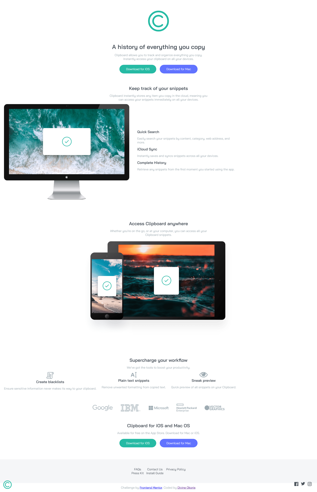

# Frontend Mentor - Clipboard landing page solution

This is a solution to the [Clipboard landing page challenge on Frontend Mentor](https://www.frontendmentor.io/challenges/clipboard-landing-page-5cc9bccd6c4c91111378ecb9). Frontend Mentor challenges help you improve your coding skills by building realistic projects. 

## Table of contents

- [Overview](#overview)
  - [The challenge](#the-challenge)
  - [Screenshot](#screenshot)
  - [Links](#links)
- [My process](#my-process)
  - [Built with](#built-with)
  - [What I learned](#what-i-learned)
  - [Continued development](#continued-development)
  - [Useful resources](#useful-resources)
- [Author](#author)
- [Acknowledgments](#acknowledgments)

## Overview

### The challenge

Users should be able to:

- View the optimal layout for the site depending on their device's screen size
- See hover states for all interactive elements on the page

### Screenshot

### Links

- Solution URL: (https://github.com/Divine25-dev/Clipboard-landing-page)
- Live Site URL: (https://gilded-meringue-606373.netlify.app/)

## My process

### Built with

- Semantic HTML5 markup
- CSS custom properties
- Mobile-first workflow

### What I learned

I finally made my social icons appear 😅

### Continued development

I still need to gain more knowledge in my icon and logos placements and stylings. 

### Useful resources

- [Example resource 1](https://www.google.com) 
- [Example resource 2](https://www.firefox.com) 

## Author

- Website - [Divine Okorie](https://github.com/Divine25-dev)
- Frontend Mentor - [@yourusername](https://www.frontendmentor.io/profile/yourusername)
- Twitter - [@Dee](https://www.twitter.com/dee_baby2502)

## Acknowledgments

A big thank you to my Teacher, Sir Stanley Okeke and my course mentor Sir Silvernus for all the knowledge.

